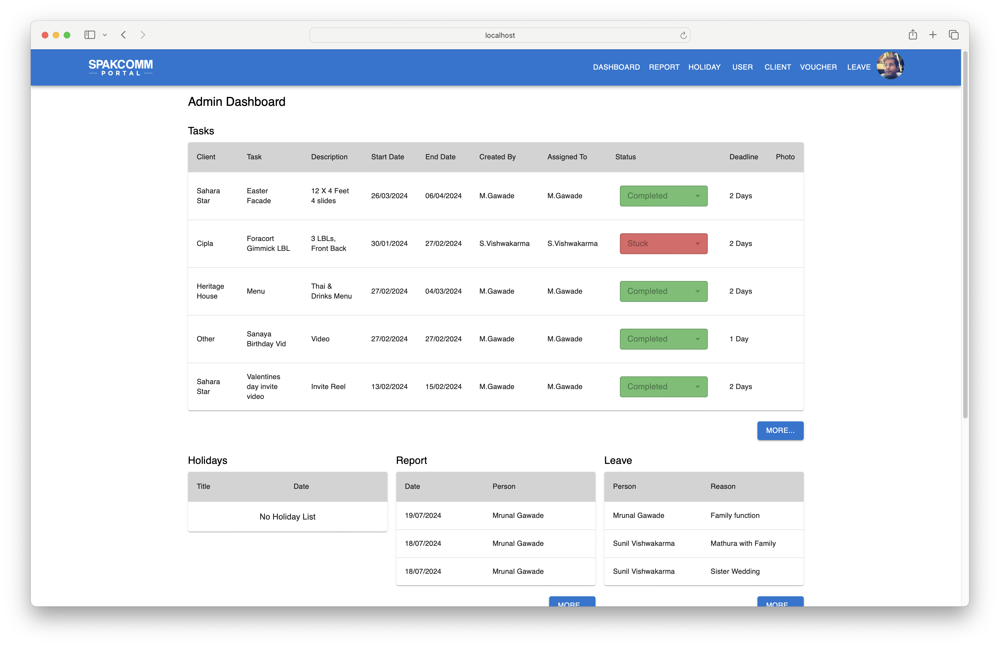
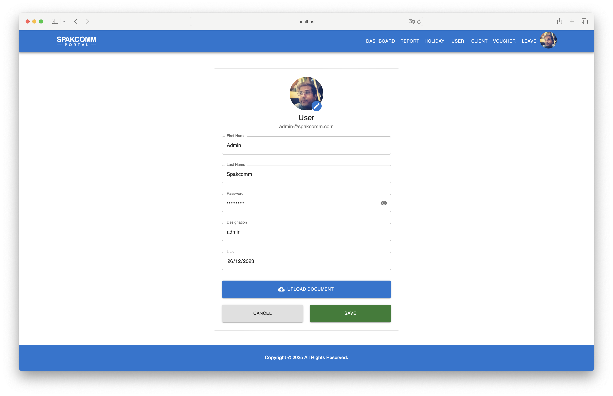
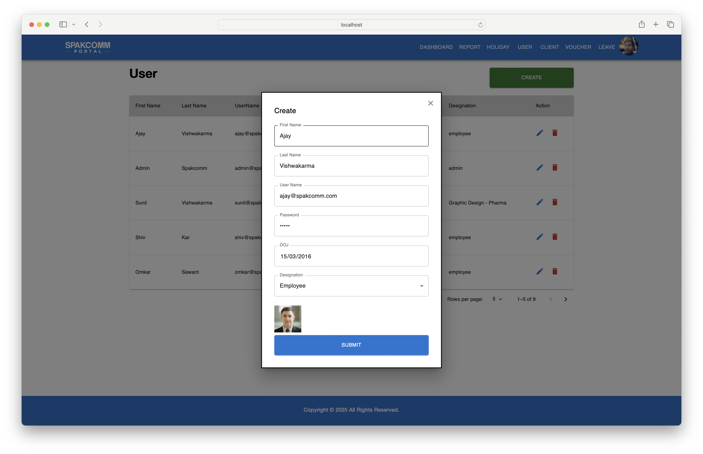
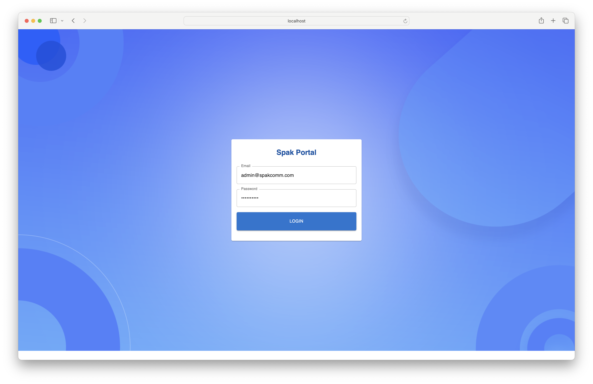
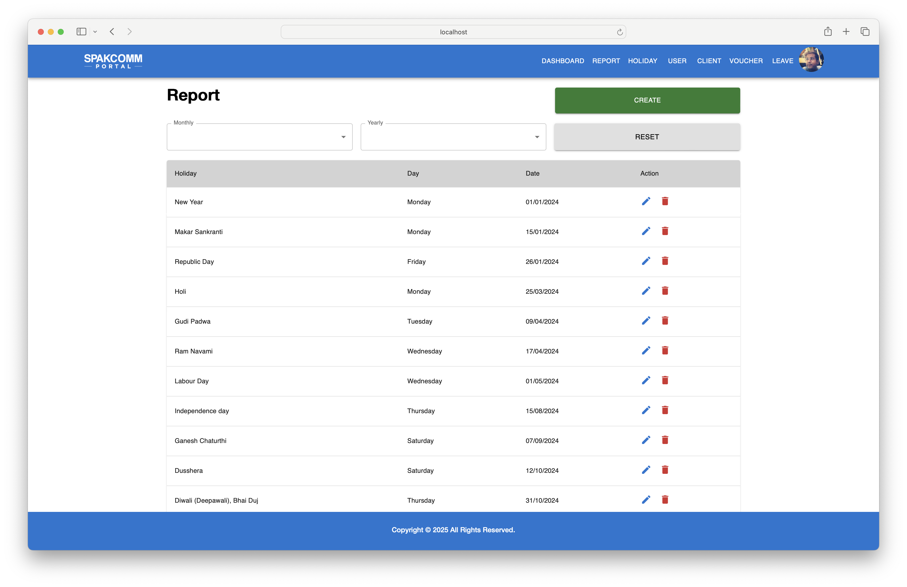
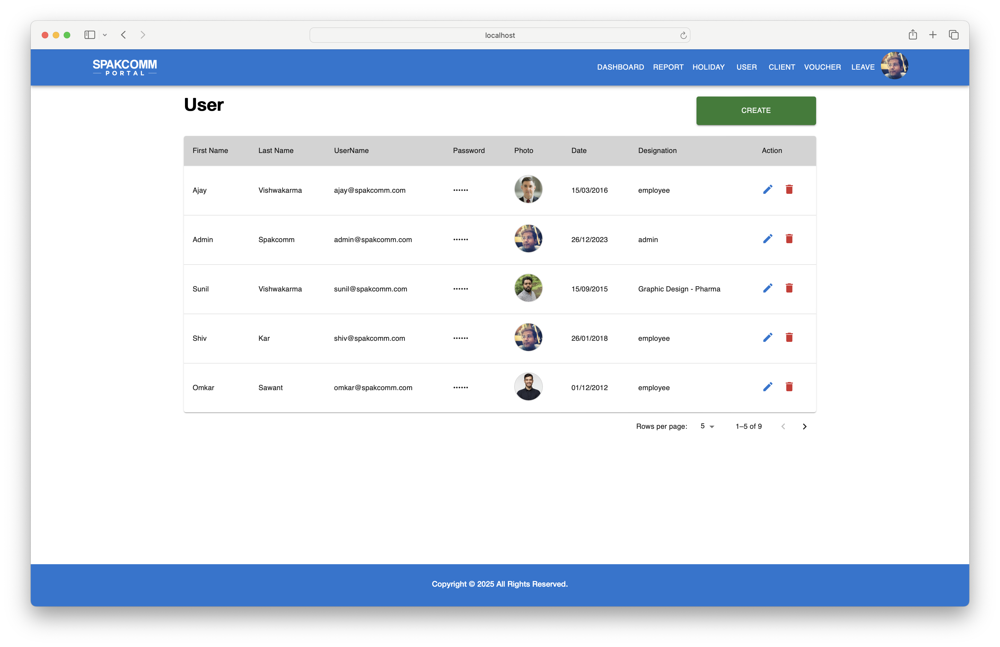

# Spak Portal

**Spak Portal** is a modern web-based administrative platform built for internal use by SpakComm. It streamlines employee management, task tracking, client operations, leave approvals, and voucher processing — all from one intuitive interface.



---

## 🚀 Key Features

### 👤 User Management
- Create and update employee profiles with:
  - Name, Designation, Email, Password
  - Date of Joining (DOJ)
  - Profile photo and secure credentials
- Upload documents for each user



---

### 🧾 Voucher Management
- Submit, view, and filter vouchers
- Track status: Approved, Rejected, or Pending
- Include metadata like date, amount, and approval logs


---

### 📅 Leave Management
- Apply for leaves with a reason and duration
- Admins can approve or reject applications
- Filter leave logs by employee and status



---

### 🏢 Client Management
- Add and manage clients with company name and joining date
- Update or delete entries through modal confirmation



---

### 📊 Dashboard Overview
- Displays snapshot of all portal activity
- Quick access to user counts, reports, and active modules


---

### 📆 Holiday Manager
- Maintain a yearly holiday calendar
- Add new holidays or delete existing ones
- Search holidays by title or date



---

### 📝 Report Module
- View submitted reports by users
- Filter reports by date or user



---

## 🛠 Tech Stack

| Layer        | Technologies                     |
|--------------|----------------------------------|
| Frontend     | ReactJS                          |
| Styling      | Bootstrap, HTML, CSS             |
| State Mgmt   | React Hooks                      |
| Icons/Assets | FontAwesome, Custom Media Assets |
| Backend API  | *(Assumed REST API connection)*  |

---

## 📁 Folder Structure
spak-portal/
├── public/
├── src/
│ ├── components/
│ ├── pages/
│ ├── services/
│ ├── App.js
│ └── index.js
├── screenshots/
├── .env
└── package.json


---

## ⚙️ Getting Started

Clone the repo and run the development server:

```bash
git clone https://github.com/ajayvishwakarma457/spak-portal.git
cd spak-portal
npm install
npm start

## 📬 Contact
**Author:** Ajay M Vishwakarma  
**Email:** ajayvishwakarma457@gmail.com

